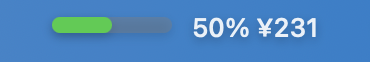

# Salary Widget

A macOS menu bar application that tracks your daily earnings in real-time based on your work schedule and salary.

## Features

- **Real-time Earnings Tracking**: See how much you've earned today as you work
- **Progress Visualization**: Visual progress bar showing work day completion
- **Customizable Schedule**: Set your work hours and select working days
- **Menu Bar Integration**: Compact display in the macOS menu bar
- **Settings Panel**: Easy configuration through a clean interface

## Screenshots

The widget displays in your menu bar with:
- Progress percentage of your work day
- Current earnings for today
- Visual progress bar

## Configuration

Click on the menu bar widget to open the settings panel where you can configure:

### Salary Settings (薪资设置)
- **Monthly Salary (月薪资)**: Your monthly salary in CNY
- **Working Days (工作天数)**: Number of working days per month

### Working Time Settings
- **Starting Time**: When your work day begins (HH:MM format)
- **Off-duty Time**: When your work day ends (HH:MM format)
- **Weekdays**: Select which days of the week you work

## How It Works

The app calculates your earnings based on:
1. **Daily Wage**: Monthly salary ÷ Working days per month
2. **Hourly Rate**: Daily wage ÷ Hours worked per day
3. **Real-time Earnings**: Progress through work day × Daily wage

The menu bar updates every 10 seconds to show:
- Current progress percentage
- Earnings accumulated so far today
- Visual progress bar

## System Requirements

- macOS 12.0 or later
- Xcode 14.0 or later (for building from source)

## Installation

### Building from Source

1. Clone this repository
2. Open `salary-widget.xcodeproj` in Xcode
3. Build and run the project
4. The app will appear in your menu bar

## Usage

1. **Initial Setup**: Click the menu bar icon to open settings
2. **Configure Salary**: Enter your monthly salary and working days
3. **Set Schedule**: Configure your daily work hours and working days
4. **Monitor Earnings**: The menu bar will show your real-time progress and earnings

## Technical Details

- Built with SwiftUI and AppKit
- Uses NSStatusItem for menu bar integration
- Timer-based updates every 10 seconds
- Persists settings using Core Data

## License

MIT
